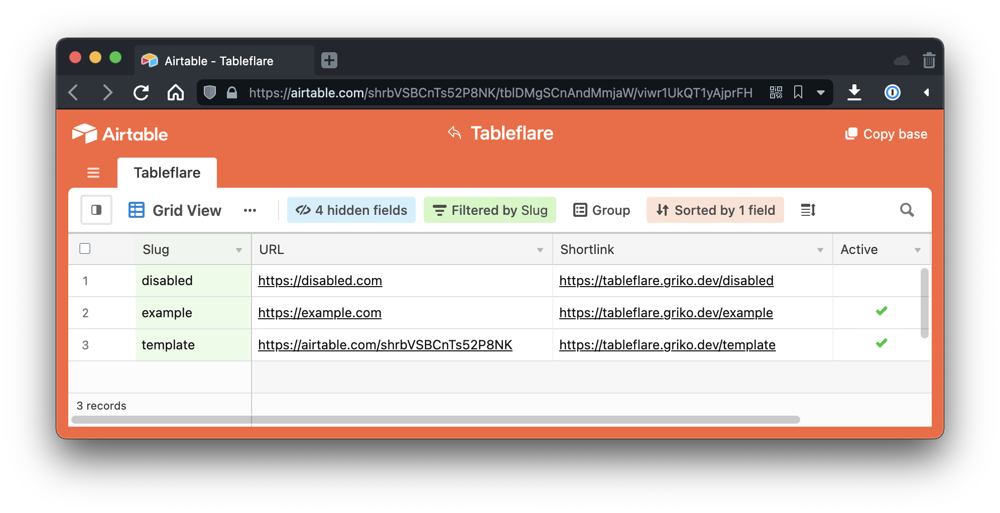

<!-- markdownlint-disable MD033 MD034 MD036 MD041 -->



# tableflare

Airtable + Cloudflare Workers URL Shortener 🌤

[](https://deploy.workers.cloudflare.com/?url=https://github.com/grikomsn/tableflare)

## Quick Start

**Airtable**

- Generate your Airtable API key from your account dashboard: https://airtable.com/account
- Copy tableflare base template to your account: https://tableflare.griko.dev/template

**GitHub project and Cloudflare Workers**

- Generate your own tableflare repository using this template: https://tableflare.griko.dev/generate
- Generate your API token on your Cloudflare dashboard: https://tableflare.griko.dev/generate-cf-token
- Add your generated token as `WRANGLER_TOKEN` secret value on your GitHub project
- Edit [`wrangler.toml`](./wrangler.toml) with your credentials ([read more below](#configuration))
- Push your changes and it'll deploy automatically using [Cloudflare's Wrangler GitHub Actions](https://github.com/cloudflare/wrangler-action)

## Configuration

**wrangler.toml**

```toml
# change values with your credentials
account_id = ""
zone_id = ""

name = "tableflare"
route = "tableflare.griko.dev/*" # change value to your worker name
type = "javascript"
workers_dev = true

compatibility_date = "2022-01-06"

[vars]

# change values with your credentials
AIRTABLE_BASE = "appxxxxxxxxxxxxxx"
AIRTABLE_KEY = "keyxxxxxxxxxxxxxx"

# pass any valid url for base redirect
DEFAULT_REDIRECT = "https://github.com/grikomsn/tableflare"

# if you rename your table on airtable, make sure to change this
TABLE_NAME = "Tableflare"

```

## License

[MIT License, Copyright (c) 2022 Griko Nibras](./LICENSE)
